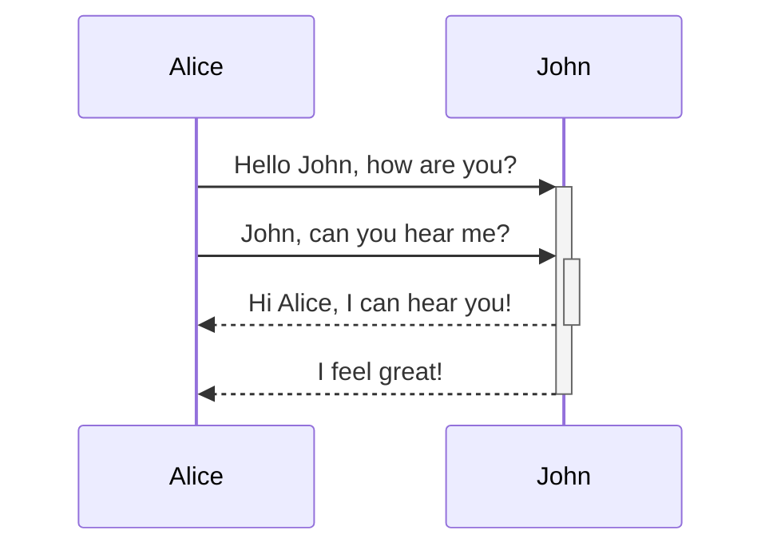
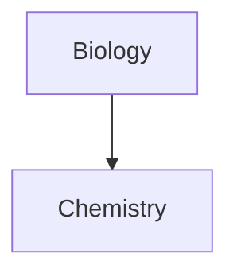

> [!info]+ Open Callout default
> helloas
> a sd

> [!faq]- Another collaout collapsed
> ansodansda sd
> as

> [!SIDENOTE]
> A sidenote! looks different on shimmering focus

check [callouts](https://help.obsidian.md/Editing+and+formatting/Callouts)
==highilighting==
~~Striking out text~~

**Bold text and _nested italic_ text**

> blocks of text
> is here

***
****
* * *
---
----
- - -
___
____
_ _ _

This is an inline. [^note]
Another inline [^1]

[^1]: This is a footnote
[^note]: Named footnote

This is an %%inline%% comment.

%%
This is a block comment.

Block comments can span multiple lines.
%%

(only viewable in editing view)

Left-aligned text | Center-aligned text | Right-aligned text
:-- | :--: | --:
Content | Content | Content with link [[Notes Reference|alias]]

$$
\begin{vmatrix}a & b\\
c & d
\end{vmatrix}=ad-bc
$$
